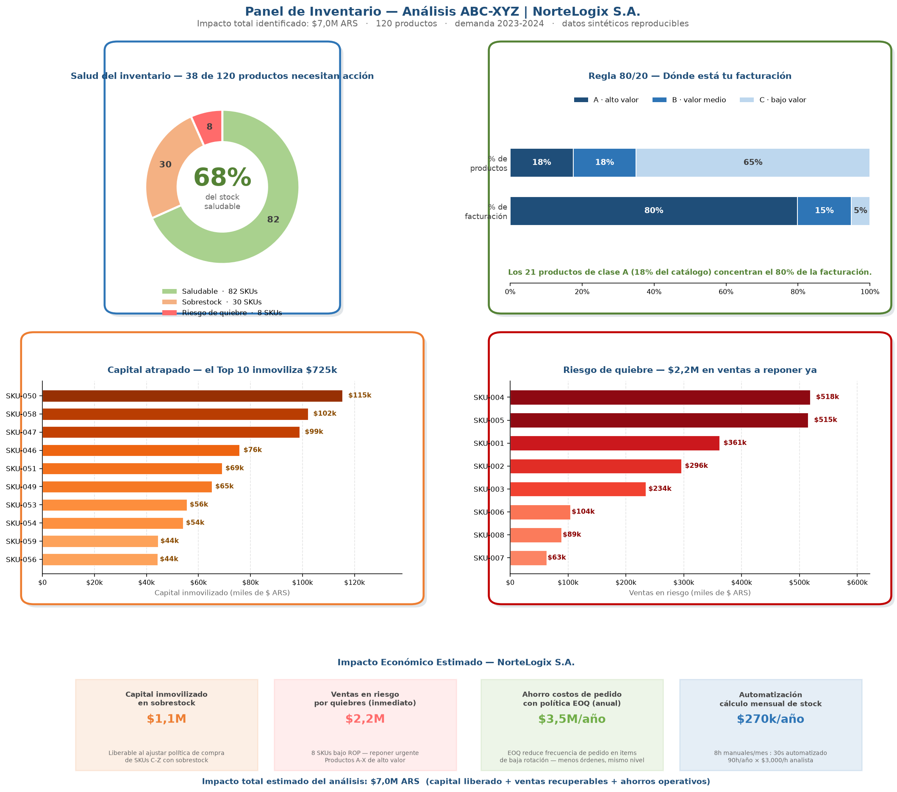

# 👋 Hola, soy Luciano Villagrán

**Analista de Datos | Excel · SQL · Python · Power BI · n8n | Tucumán, Argentina**

Convierto datos desordenados en **decisiones con números**: cuánto dinero se está perdiendo, dónde, y qué hacer para recuperarlo. Cada proyecto de este portfolio parte de un **problema real de una empresa** y termina con un **impacto medible en dinero o en horas de trabajo ahorradas**.

  
   
  <i>Ejemplo real de entregable: panel de control de inventario que identifica ~$7,0 M ARS entre capital atrapado, ventas en riesgo y ahorros. (Proyecto de Optimización de Inventario)</i>

---

## 🧑‍💼 ¿Sos reclutador/a y no venís del mundo técnico? Leé esto primero

No hace falta entender SQL, Python ni Power BI para evaluar este portfolio. Cada proyecto responde **una sola pregunta**: *"¿cuánta plata o cuánto tiempo le ahorré (o le generé) a la empresa?"*

En criollo, esto es lo que hice en cada caso:

| Proyecto | En una frase, sin tecnicismos | Beneficio |
|---|---|---|
| 📦 **Inventario FMCG** | Ordené el depósito de una distribuidora para que no falten los productos que más se venden ni sobren los que no rotan | Encontré **$22,5 M ARS** de mercadería frenada y bajé el reporte de 5 h a 20 min |
| 📊 **Paros y Mantenimiento** | Descubrí qué máquinas de una fábrica paran más y cuánto cuesta cada hora frenada | **~$8,6 M ARS/año** de producción recuperable |
| 🗄️ **Rentabilidad Comercial** | Encontré productos que se vendían a pérdida y clientes que se estaban yendo sin que nadie lo notara | **~$2,0 M ARS/año** de margen recuperable |
| 🐍 **Reporte Automático + Clientes** | Reemplacé un reporte que se hacía a mano cada mes y agrupé a los clientes para saber a quién retener | **~$1,0 M ARS/año** (tiempo + clientes retenidos) |
| 🐍 **Optimización de Inventario** | Calculé cuánto comprar de cada producto para no gastar de más ni quedarme sin stock | **~$7,0 M ARS** entre capital y ventas |

> 💡 **Cómo leer los números:** son **estimaciones sobre datos simulados** (inventados con criterio realista para poder mostrar el método sin usar información confidencial de ninguna empresa). Cada proyecto explica sus supuestos en un archivo `informe.md`. Todas las cifras están en **pesos argentinos (ARS)**.

---

## 🗂️ Estructura del portfolio

| Carpeta | Herramienta | Estado |
|---|---|---|
| [`proyectos/excel/`](./proyectos/excel/) | Microsoft Excel | 🟢 Activo |
| [`proyectos/python/`](./proyectos/python/) | Python | 🟢 Activo |
| [`proyectos/sql/`](./proyectos/sql/) | SQL | 🟢 Activo |
| [`proyectos/power-bi/`](./proyectos/power-bi/) | Power BI | 🔜 Próximamente |
| [`proyectos/n8n/`](./proyectos/n8n/) | Automatización n8n | 🔜 Próximamente |
| [`proyectos/integraciones/`](./proyectos/integraciones/) | Multi-herramienta | 🔜 Próximamente |

---

## 🧭 Matriz del portfolio — Herramientas × Sectores

  
  
  
  
  

Cada herramienta resuelve problemas reales en distintos **sectores** de un negocio.
👉 **Hacé clic en un ✅ para ir directo al proyecto.**

| Sector | 🗄️ SQL | 🐍 Python | 📊 Power BI | 📗 Excel | ⚡ n8n |
|---|:---:|:---:|:---:|:---:|:---:|
| **🚚 Logística y Cadena de Suministro** | 🟡 | [✅](./proyectos/python/optimizacion-inventario-abcxyz/) | 🟡 | [✅](./proyectos/excel/logistica-inventario-fmcg/) | 🟡 |
| **🛒 Comercial / Retail** | [✅](./proyectos/sql/rentabilidad-comercial-retail/) | [✅](./proyectos/python/automatizacion-reporte-comercial-rfm/) | 🟡 | 🟡 | — |
| **💰 Finanzas** | 🟡 | 🟡 | 🟡 | 🟡 | — |
| **👥 Recursos Humanos** | 🟡 | 🟡 | 🟡 | 🟡 | — |
| **⚙️ Operaciones** | 🟡 | 🟡 | 🟡 | [✅](./proyectos/excel/gestion-paros-productividad-manufactura/) | 🟡 |
| **🔧 Mantenimiento** | 🟡 | 🟡 | 🟡 | 🟡 | — |

**Leyenda:** ✅ publicado (clic para abrir) · 🟡 planificado · — no aplica

<b>📂 Proyectos publicados (5)</b> — clic para desplegar / ocultar

 

> ### 📦 Sistema de Control de Inventario FMCG &nbsp;·&nbsp; `Excel`
> **Sector:** Logística y Cadena de Suministro
> Gestión de inventario de 75 productos que detecta faltantes inminentes y mercadería sin rotación.
> 💰 **Impacto:** $22,5 M ARS de capital identificado · −93 % de tiempo de reportería
> 🔗 [Abrir proyecto →](./proyectos/excel/logistica-inventario-fmcg/)

> ### 📊 Panel de Paros, OEE y Mantenimiento Preventivo &nbsp;·&nbsp; `Excel + VBA`
> **Sector:** Operaciones / Manufactura
> Panel de 4 hojas que mide la eficiencia de cada máquina, prioriza las 3 que más fallan y automatiza el reporte mensual.
> 💰 **Impacto:** ~$8,6 M ARS/año recuperables · 64 % del tiempo parado concentrado en 3 equipos
> 🔗 [Abrir proyecto →](./proyectos/excel/gestion-paros-productividad-manufactura/)

> ### 🗄️ Análisis de Rentabilidad Comercial &nbsp;·&nbsp; `SQL`
> **Sector:** Comercial / Retail
> Detecta productos vendidos a pérdida, clientes que se fueron y sucursales que rinden por debajo.
> 💰 **Impacto:** ~$2,0 M ARS/año identificados
> 🔗 [Abrir proyecto →](./proyectos/sql/rentabilidad-comercial-retail/)

> ### 🐍 Automatización del Reporte Comercial + RFM &nbsp;·&nbsp; `Python`
> **Sector:** Comercial / Retail
> Reemplaza el reporte mensual manual y agrupa clientes (RFM) para priorizar la retención.
> 💰 **Impacto:** ~$1,0 M ARS/año (horas ahorradas + retención)
> 🔗 [Abrir proyecto →](./proyectos/python/automatizacion-reporte-comercial-rfm/)

> ### 🐍 Optimización de Inventario — Clasificación ABC-XYZ y Política de Stock &nbsp;·&nbsp; `Python`
> **Sector:** Logística y Cadena de Suministro
> Calcula, para cada uno de 120 productos, cuánto pedir y cuándo, para no gastar de más ni quedarse sin stock.
> 💰 **Impacto:** ~$7,0 M ARS (capital liberado + ventas recuperadas + ahorros + automatización)
> 🔗 [Abrir proyecto →](./proyectos/python/optimizacion-inventario-abcxyz/)

---

## 🚀 Proyecto destacado

### 🐍 Optimización de Inventario — Clasificación ABC-XYZ
> Python · Logística y Cadena de Suministro

**El problema en una frase:** una distribuidora compraba "a ojo" y el resultado era el peor de los dos mundos — depósitos llenos de productos que casi nadie pide y faltantes justo de los que más se venden.

**Lo que hice:** un modelo que calcula, para cada uno de los 120 productos, **cuánto pedir y en qué momento**, y que se actualiza solo cada mes en 30 segundos (antes: 8 horas de trabajo manual).

**El resultado:**
- 💰 **$1,1 M ARS** de capital atrapado en productos que sobran → liberable.
- 🚨 **$2,2 M ARS** en ventas que se perdían por quedarse sin stock → recuperable.
- 📉 **$3,5 M ARS/año** de ahorro comprando en lotes óptimos + **$0,27 M ARS/año** por automatizar el cálculo.
- 🎯 **Impacto total estimado: ~$7,0 M ARS.**

[→ Ver el proyecto completo, con dashboard y reporte en PDF](./proyectos/python/optimizacion-inventario-abcxyz/)

---

## 📬 Contacto

- 📧 **Email:** lucianovillagran75@gmail.com
- 💻 **GitHub:** [github.com/lucianovillagran75-arg](https://github.com/lucianovillagran75-arg)
- 📍 **Ubicación:** San Miguel de Tucumán, Argentina · Disponibilidad inmediata

---

*Stack: Excel · Python · SQL · Power BI · n8n · Todos los proyectos usan datos sintéticos reproducibles (semilla fija), sin información confidencial de empresas reales.*
