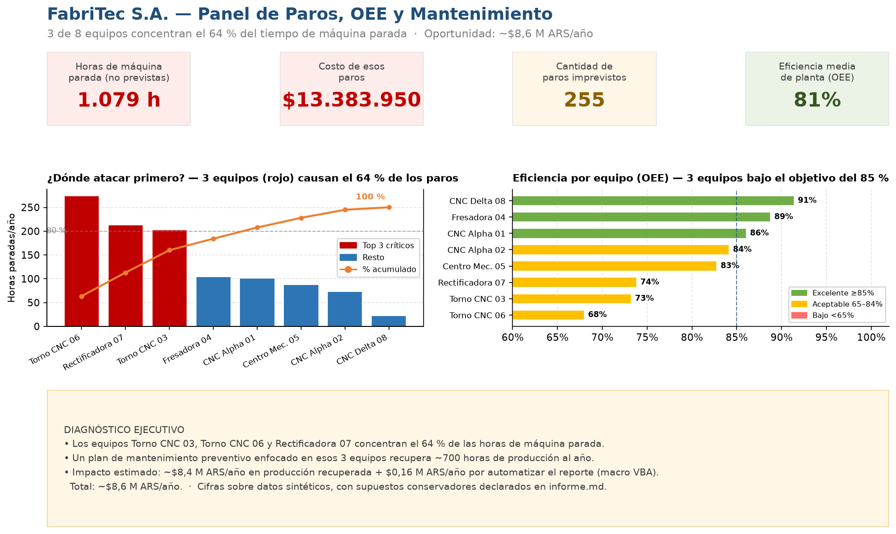

# 📊 Panel de Paros, OEE y Mantenimiento Preventivo — Manufactura

> **Herramienta:** Excel Avanzado + VBA
> **Sector:** Operaciones / Manufactura
> **Contexto:** Planta manufacturera "FabriTec S.A." — 8 equipos CNC · 3 turnos · 307 registros de paro
> **Período:** Enero – Diciembre 2024

---

## 🎯 El problema

El área de mantenimiento de FabriTec llevaba los paros en un cuaderno y un Excel básico sin análisis.
Cuando una máquina fallaba, la noticia llegaba cuando ya era tarde: el turno perdido, el pedido
atrasado, el costo impacto en el balance del mes siguiente.

Tres preguntas que nadie podía responder:

- ¿Cuánto le costó a la empresa **cada hora de línea parada**?
- ¿Qué **3 causas raíz** generan el 80 % del downtime? (Ley de Pareto)
- ¿Qué máquinas están **a punto de vencer su mantenimiento** antes de que fallen?

> *"Cuando la máquina 3 paró un viernes a las 14 h, perdimos el turno completo.
> Nos enteramos de cuánto costó tres semanas después, cuando cerró la quincena."*

---

## 💡 La solución

Construí un **panel Excel de 4 hojas interconectadas** que convierte el registro de paros en
decisiones de mantenimiento con números, y le sumé una **macro VBA** para generar el informe
mensual con un solo clic.

```
Equipos          →  Semáforo de vencimientos (verde / amarillo / rojo)
Registro_Paros   →  307 eventos con costo calculado automáticamente
Analisis_OEE     →  OEE por equipo + Pareto de causas de fallo
Dashboard        →  Vista ejecutiva + gráficos + diagnóstico y ahorro proyectado
```

El diferencial: no solo muestra **qué pasó**, sino **dónde atacar** (Pareto) y **qué va a pasar**
(semáforo de vencimientos) — antes de que cueste plata.

---

## 📊 Resultados

| Métrica | Antes | Después | Impacto |
|---|---|---|---|
| Visibilidad del costo de paros | Ninguna | Costo calculado por evento | Decisiones con datos |
| Identificación de causas raíz | Reporte manual (semanas después) | **Pareto automático** en tiempo real | Foco de inversión |
| OEE por equipo | No medido | **3 equipos bajo 65 %** identificados | Plan preventivo priorizado |
| Vencimientos de service | Cuaderno manual | **Semáforo automático** (2 equipos en rojo) | Paros evitados |
| Reporte mensual | 3 h/mes manual | **1 clic** (macro VBA) | **$162.000/año** ahorrados |

### 💰 Impacto total estimado: **~$8,6 M/año**

| Hallazgo | Acción | Impacto $/año | Supuesto |
|---|---|---|---|
| Top 3 equipos = 64 % del downtime NP | Plan preventivo focalizado | **$8,4 M** | 700 h recuperadas × $12.000/h |
| Reporte manual (3 h/mes) | Macro VBA | **$162.000** | 36 h/año × $4.500/h |
| **Total** | | **~$8,6 M/año** | |

> 💡 Todas las cifras están en **pesos argentinos (ARS)** y son **estimaciones sobre datos simulados**, con los supuestos declarados arriba y en [`informe.md`](./informe.md).

---

## 📈 Vista previa del panel (para verlo sin abrir Excel)

Así se ve el tablero ejecutivo que resume la operación de la planta:



**Cómo se lee, en criollo:**
- El gráfico de la izquierda ordena las máquinas por **horas paradas**: las **3 primeras (en rojo) causan el 64 %** de todo el tiempo perdido → ahí conviene invertir primero.
- El de la derecha muestra la **eficiencia de cada máquina (OEE)**: las que están en amarillo/rojo rinden por debajo del objetivo y arrastran la producción.
- El recuadro final traduce todo a plata: enfocar el mantenimiento en esas 3 máquinas recupera **~$8,6 M ARS/año**.

> **¿Qué es el OEE?** Es una nota del 0 al 100 % que resume qué tan bien aprovecha su tiempo una máquina (combina disponibilidad, velocidad y calidad). Es el indicador estándar que usan las plantas industriales; 85 % se considera "de clase mundial".

---

## 🔧 Técnicas utilizadas

- **Formato condicional avanzado**: semáforo (verde/amarillo/rojo) dinámico según días restantes al próximo service — sin fórmulas visibles, solo lógica interna.
- **Tabla Excel nativa** (`Ctrl+T`) en `Registro_Paros`: filtros automáticos, expansión dinámica de rangos, columna de costo calculado.
- **OEE completo**: Disponibilidad (h_disponibles − h_paradas) × Rendimiento × Calidad — indicador estándar ISO 22400 del sector manufactura.
- **Pareto de causas**: tabla ordenada por horas DESC + columna `% acumulado`, identifica con precisión qué 3 causas generan el 80 % del downtime.
- **Gráfico combinado** (barras + línea acumulada): visualiza el Pareto con doble eje Y, patrón que pocos analistas ejecutan en Excel nativo.
- **Macro VBA** (`InformeMensual`): copia el Dashboard, congela valores, inserta fecha y guarda como `Informe_MM_YYYY.xlsx` en un solo paso.
- **Macro auxiliar** (`ActualizarSemaforo`): recalcula los colores del semáforo al abrir el archivo meses después.

---

## 📁 Archivos

| Archivo | Descripción |
|---|---|
| [`output/Panel_Paros_OEE_Portfolio.xlsx`](./output/Panel_Paros_OEE_Portfolio.xlsx) | Entregable principal (4 hojas + gráficos) |
| [`output/macros/InformeMensual.bas`](./output/macros/InformeMensual.bas) | Código VBA listo para pegar en Alt+F11 |
| [`datos/generar_datos.py`](./datos/generar_datos.py) | Generador reproducible (semilla fija SEED=42) |
| [`datos/equipos.csv`](./datos/equipos.csv) · [`datos/registro_paros.csv`](./datos/registro_paros.csv) | Datos fuente |
| [`construir_panel.py`](./construir_panel.py) | Script Python que genera el Excel desde los CSV |
| [`generar_dashboard.py`](./generar_dashboard.py) | Genera la vista previa PNG del panel (para el README) |
| [`output/dashboard_paros_oee.png`](./output/dashboard_paros_oee.png) | Vista previa del panel ejecutivo |
| [`informe.md`](./informe.md) | Hallazgos completos con supuestos declarados |
| [`PASO_A_PASO.md`](./PASO_A_PASO.md) | Proceso de construcción fase a fase |

---

## ▶️ Cómo reproducirlo

```bash
cd proyectos/excel/gestion-paros-productividad-manufactura
python datos/generar_datos.py    # genera los 2 CSV (equipos + registro_paros)
python construir_panel.py        # genera Panel_Paros_OEE_Portfolio.xlsx
python generar_dashboard.py      # genera la vista previa PNG del panel
```

Para agregar la macro al Excel:
1. Abrir `Panel_Paros_OEE_Portfolio.xlsx`
2. Presionar `Alt+F11` → Insertar → Módulo
3. Pegar el contenido de `output/macros/InformeMensual.bas`
4. Cerrar el editor (`Alt+Q`) y ejecutar con `Alt+F8`

---

## 🧠 Qué demuestra este proyecto

Que Excel no es solo una hoja de datos — es una **herramienta de decisión operativa** cuando
se le aplica la metodología correcta.

Detecté que **3 de 8 equipos concentran el 64 % del downtime no programado** y que recuperar
esas ~700 horas/año representan **$8,4 M anuales** en producción no perdida.
Nadie en la planta lo sabía porque nadie había cruzado los registros de paros con el costo
por hora de cada línea.

El OEE, el Pareto de causas y el semáforo de vencimientos son las 3 métricas que usan las
plantas de clase mundial. Este panel las lleva a un Excel accesible para cualquier equipo de
operaciones, sin invertir en software especializado.

---

*Datos simulados con distribuciones realistas del sector manufacturero · Portfolio de Datos y Analítica*
