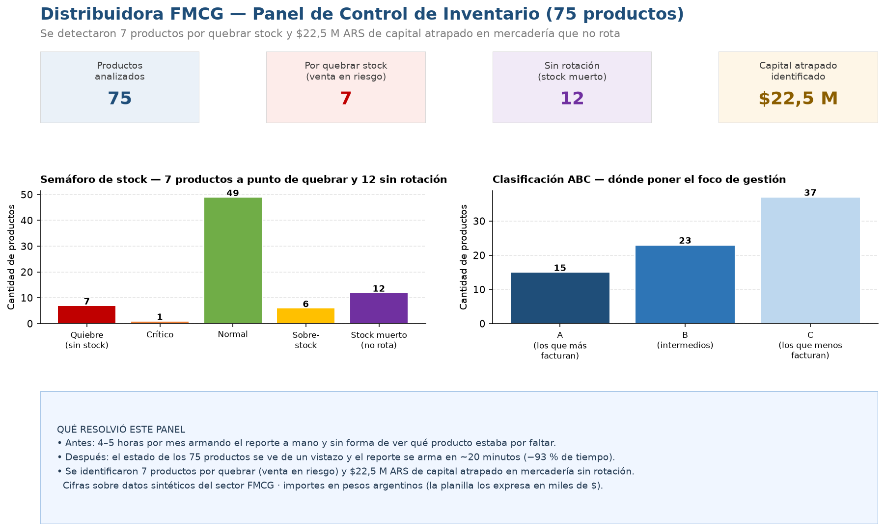

# 📦 Sistema de Control de Inventario — Distribuidora FMCG

> **Herramienta:** Microsoft Excel Avanzado
> **Sector:** Logística / Cadena de Suministro
> **Contexto:** Distribuidora de productos de consumo masivo (FMCG)
> **Período:** Enero – Junio 2025 · 75 SKUs · 3 categorías

---

## 🎯 El problema

Una distribuidora de consumo masivo con 75 SKUs activos **no tenía visibilidad sobre el estado real de su inventario**.

El equipo operativo dedicaba **4 a 5 horas mensuales** consolidando datos en planillas separadas, sin un criterio unificado para detectar problemas. El resultado era siempre el mismo: capital inmovilizado en productos sin rotación, quiebres de stock en los productos más vendidos, y decisiones de compra reactivas en lugar de planificadas.

> *"Nos enterábamos que faltaba mercadería cuando el cliente ya había llamado."*

---

## 💡 La solución

Diseñé un sistema de gestión de inventario en Excel con **4 hojas interconectadas** que convierte datos crudos en decisiones operativas en minutos.

### Arquitectura del archivo

```
Inventario_FMCG_Portfolio.xlsx
│
├── 📋 Base_Datos     → 75 SKUs · 19 columnas · 6 meses de ventas
├── 📊 Análisis       → 9 KPIs por SKU · Clasificación ABC · Semáforo automático
├── 🚨 Alertas        → Panel operativo · 4 categorías de riesgo
└── 📈 Dashboard      → Vista ejecutiva · 4 gráficos · Comparativa antes/después
```

---

## 📊 Resultados

| Métrica | Antes | Después | Δ |
|---|---|---|---|
| Capital en stock muerto identificado | No medido | **$22,5 M ARS** | +100% visibilidad |
| Quiebres de stock detectados | 0 (sin sistema) | **7 SKUs alertados** | Acción inmediata |
| Tiempo de reportería mensual | ~270 min | **~20 min** | **-93%** |
| SKUs sin visibilidad de estado | 75 | **0** | Panel completo |
| Alertas automáticas activas | 0 | **4 tipos** | Quiebre/Muerto/Sobre/Crítico |
| Clasificación ABC disponible | No | **Sí (automática)** | Priorización por percentil |

> 💡 Importes en **pesos argentinos (ARS)**: la planilla expresa los valores en **miles de $**, por lo que el capital en stock muerto (22.473 miles) equivale a **$22,5 M ARS**. Es una **estimación sobre datos simulados** del sector FMCG.

---

## 📈 Vista previa del panel (para verlo sin abrir Excel)

Así se ve el tablero de control, con el resumen que un gerente mira de un vistazo:



**Cómo se lee, en criollo:**
- De 75 productos, **7 están por quedarse sin stock** (venta en riesgo) y **12 no rotan** (plata parada en el depósito).
- El semáforo verde/amarillo/rojo dice, producto por producto, si hay que **comprar ya**, **frenar la compra** o **está OK**.
- La clasificación **ABC** separa los productos que más facturan (donde nunca hay que quedarse sin stock) de la "cola larga" de bajo movimiento.

---

## 🔧 Fórmulas y técnicas utilizadas

```excel
// Semáforo automático de 5 estados
=IF(cobertura<7, "🔴 QUIEBRE",
  IF(cobertura<14, "🟡 CRÍTICO",
    IF(cobertura<=90, "🟢 NORMAL",
      IF(cobertura<=180, "🟡 SOBRESTOCK", "🔴 STOCK MUERTO"))))

// Clasificación ABC por percentil dinámico
=IF(vprom >= PERCENTILE(rango, 0.8), "A",
  IF(vprom >= PERCENTILE(rango, 0.5), "B", "C"))

// Días de cobertura (protegido contra división por cero)
=IFERROR(stock / (vprom_mensual / 30), 9999)

// Capital en stock muerto (cruzado entre hojas)
=SUMIF(Análisis!K:K, "🔴 STOCK MUERTO", Análisis!H:H)
```

**Técnicas aplicadas:**
- Referencias cruzadas entre hojas (`Base_Datos` → `Análisis` → `Alertas` → `Dashboard`)
- Formato condicional con escala de colores en cobertura y rotación
- Tablas dinámicas con filtros automáticos y panel congelado
- Gráficos embebidos: distribución de estados (pie), capital por categoría (bar), evolución ventas (line), ABC (col)
- Convención de colores profesional: azul = inputs · negro = fórmulas · verde = referencias cruzadas

---

## 📁 Archivos

| Archivo | Descripción |
|---|---|
| [`Inventario_FMCG_Portfolio.xlsx`](./Inventario_FMCG_Portfolio.xlsx) | Archivo principal con las 4 hojas |
| [`generar_dashboard.py`](./generar_dashboard.py) | Genera la vista previa PNG leyendo el propio Excel (`python generar_dashboard.py`) |
| [`output/dashboard_inventario_fmcg.png`](./output/dashboard_inventario_fmcg.png) | Vista previa del panel de control |
| [`PASO_A_PASO.md`](./PASO_A_PASO.md) | Documentación del proceso de construcción |

---

## 🧠 Qué demuestra este proyecto

Este proyecto demuestra la capacidad de **transformar datos operativos en decisiones de negocio** usando únicamente Excel. Sin ERP, sin software especializado: solo el modelo correcto.

La metodología es escalable: el mismo sistema funciona con 75, 300 o 1.000 SKUs sin cambiar la estructura. La lógica de alertas y la clasificación ABC se recalculan automáticamente al actualizar los datos de entrada.

---

*Datos simulados con distribuciones realistas del sector FMCG · Portfolio de Logística y Cadena de Suministro · Analítica*