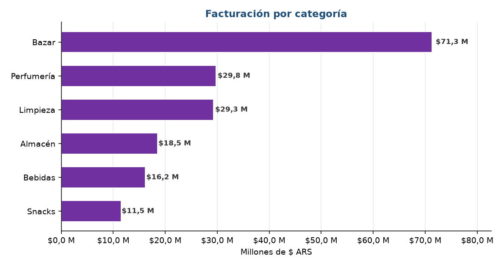

# 🐍 Automatización del Reporte Comercial + Segmentación RFM

> **Herramienta:** Python (pandas, numpy, matplotlib, XlsxWriter)
> **Sector:** Comercial / Retail
> **Contexto:** Cadena minorista "TiendaNova" (5 sucursales · 776 clientes activos · 15.700 ventas)
> **Período:** Enero 2024 – Diciembre 2025

---

## 🎯 El problema

Todos los meses, el área comercial armaba **a mano** su reporte de desempeño: exportar las ventas,
pegarlas en Excel, construir tablas dinámicas, dar formato y mandarlo por correo. Y la decisión de
**a qué clientes contactar** para retención se tomaba "a dedo".

> *"El reporte lo arma una sola persona y le lleva media mañana. Cuando llega, ya estamos a mitad
> del mes siguiente."*

**El cuello de botella:** un proceso manual, lento (≈5 horas/mes), **propenso a errores** (un
copy-paste mal y el margen queda mal calculado) y dependiente de una sola persona. Sin una
segmentación objetiva, además, el esfuerzo de retención se repartía sin criterio.

---

## 💡 La solución

Construí un **pipeline de Python reproducible** que reemplaza el armado manual y lo corre de punta
a punta con **un solo comando**, y le sumé una **segmentación RFM** que antes no existía.

```
cargar → validar → transformar → kpis → rfm → exportar → medir_impacto
```

- **Reporte automático**: KPIs mensuales, por sucursal y por categoría, en un Excel formateado +
  gráficos, generado en segundos.
- **Segmentación RFM** (Recencia, Frecuencia, Monto): clasifica a los 776 clientes en 6 segmentos
  con una **acción recomendada** para cada uno.
- **Control de calidad**: valida los datos y **mide el impacto económico** en cada corrida.

---

## 📊 Resultados

| Métrica | Antes (manual) | Después (Python) | Impacto |
|---|---|---|---|
| Tiempo de reporte mensual | ~5 h/mes | **segundos** | **60 h/año** liberadas |
| Errores de cálculo | Posibles (copy-paste) | **0** (validado) | Confiabilidad |
| Segmentación de clientes | No existía | **776 clientes en 6 grupos** | Priorización |
| Clientes "En riesgo" detectados | Invisible | **85 clientes** | **$0,73 M/año** recuperable |

### 💰 Impacto total estimado: **~$1,0 M/año**
( **$0,27 M/año** por horas ahorradas + **$0,73 M/año** por retención de clientes en riesgo )

El detalle completo, con supuestos, está en [`informe.md`](./informe.md).

---

## 📈 Visualizaciones generadas

**Segmentación RFM — distribución de los 776 clientes en 6 segmentos accionables**


**Ventas por sucursal — comparativa de desempeño entre los 5 locales**


**Tendencia mensual de ingresos y margen**


**Distribución de ventas por categoría de producto**


---

## 🔧 Técnicas utilizadas

- **ETL con pandas**: `merge` de ventas + clientes + productos + sucursales; período mensual con
  `dt.to_period`.
- **Validación de datos**: nulos, duplicados, integridad referencial y recálculo de totales.
- **RFM con quintiles** (`qcut` sobre el `rank` para evitar bordes duplicados) y segmentación por
  reglas R × FM.
- **Generación automática de Excel** formateado (XlsxWriter) y **figuras** (matplotlib).
- **Pipeline modular, reproducible e idempotente** (mismo input → mismo output).

---

## 📁 Archivos

| Archivo | Descripción |
|---|---|
| [`src/pipeline.py`](./src/pipeline.py) | Pipeline completo (cargar → … → medir_impacto) |
| [`datos/generar_datos.py`](./datos/generar_datos.py) | Generador reproducible de TiendaNova (semilla fija) |
| [`output/reporte_comercial.xlsx`](./output/reporte_comercial.xlsx) | Reporte final formateado (5 hojas) |
| [`output/segmentos_rfm.csv`](./output/segmentos_rfm.csv) | Lista accionable de clientes por segmento |
| [`output/figuras/`](./output/figuras/) | Gráficos del reporte |
| [`informe.md`](./informe.md) · [`PASO_A_PASO.md`](./PASO_A_PASO.md) | Hallazgos y proceso de construcción |

---

## ▶️ Cómo reproducirlo

```bash
cd proyectos/python/automatizacion-reporte-comercial-rfm
python datos/generar_datos.py     # genera los CSV (semilla fija)
python src/pipeline.py            # genera el reporte, las figuras y mide el impacto
```

---

## 🧠 Qué demuestra este proyecto

Demuestra cómo **Python convierte un proceso manual en un activo reproducible**: lo que tomaba
horas y dependía de una persona pasa a correr en segundos, sin errores, y encima agrega una capa
analítica (RFM) que habilita decisiones de retención con datos. La misma lógica escala a millones
de ventas sin cambiar el código.

---

*Datos simulados con distribuciones realistas del sector retail · Portfolio de Datos y Analítica*
