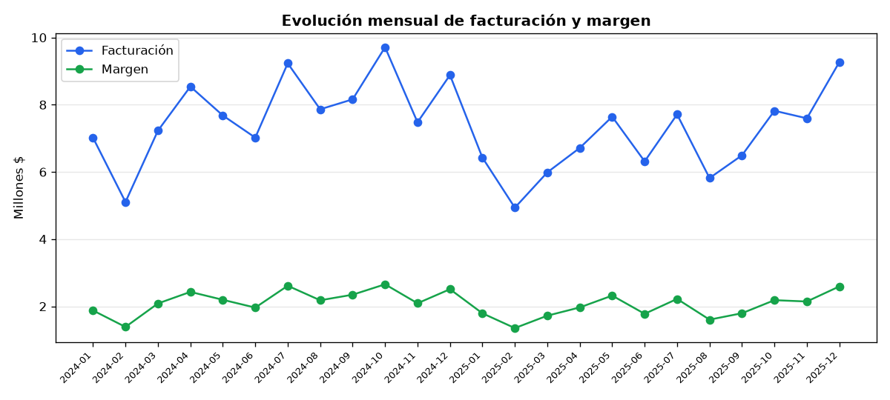
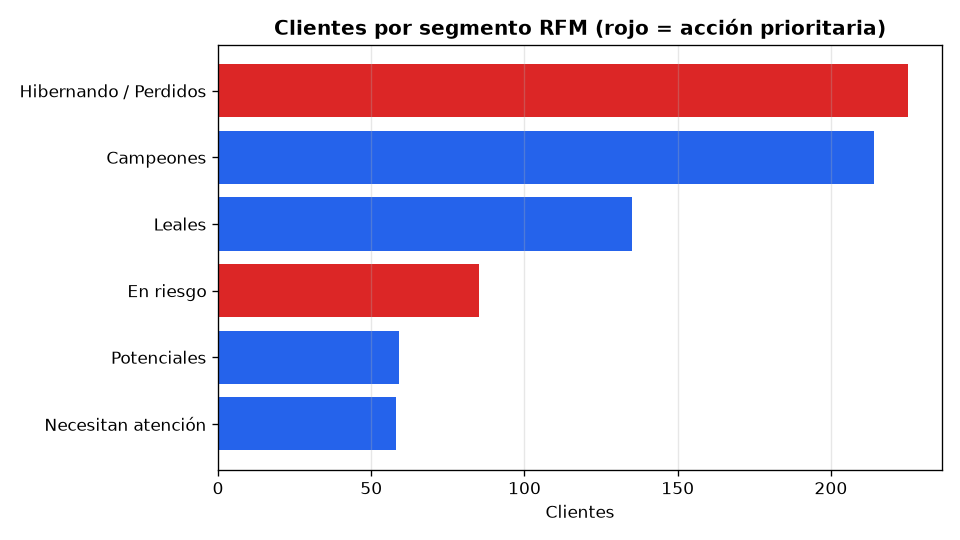
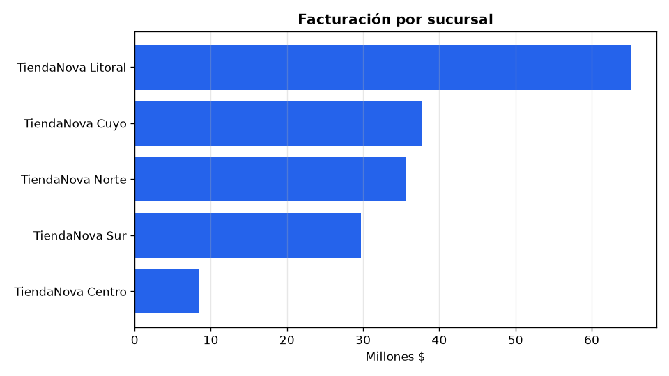

# 📈 Informe — Reporte Comercial Automático + RFM (TiendaNova)

> Generado por `src/pipeline.py` sobre 24 meses de ventas (ene-2024 a dic-2025).
> Todas las cifras son reproducibles y cada estimación de impacto declara su supuesto.

---

## 1. El reporte que antes se hacía a mano

El pipeline arma en segundos los KPIs que el equipo comercial calculaba manualmente. Ejemplo del
**último mes (diciembre 2025)**:

| KPI | Valor | Variación mensual |
|---|---:|---:|
| Facturación | $9,27 M | **+22 %** |
| Margen | $2,59 M (28 %) | — |
| Clientes activos | 252 | — |

La estacionalidad es clara: diciembre es el pico del año. El reporte completo (por sucursal y por
categoría) está en [`output/reporte_comercial.xlsx`](./output/reporte_comercial.xlsx).

---

## 2. Segmentación RFM → priorizar la retención

Clasifiqué a los **776 clientes** según Recencia, Frecuencia y Monto:

| Segmento | Clientes | % | Margen aportado | Acción |
|---|---:|---:|---:|---|
| Campeones | 214 | 28 % | $35,2 M | Fidelizar (VIP) |
| Leales | 135 | 17 % | $7,5 M | Upsell y recompensas |
| **En riesgo** | **85** | **11 %** | **$4,9 M** | **Recuperación urgente** |
| Hibernando / Perdidos | 225 | 29 % | $1,4 M | Recuperación de bajo costo |
| Potenciales | 59 | 8 % | $0,4 M | Incentivar 2ª compra |
| Necesitan atención | 58 | 8 % | $0,4 M | Ofertas reactivadoras |

**El hallazgo accionable:** 85 clientes **"En riesgo"** son valiosos (aportaron $4,9 M de margen en
24 meses) pero se están enfriando. Es el grupo con mejor relación valor/urgencia para una campaña
de recuperación. La lista completa está en [`output/segmentos_rfm.csv`](./output/segmentos_rfm.csv).

---

## 3. Dónde se concentra el negocio

La sucursal **Litoral** concentra el 37 % de la facturación ($65,2 M). En categorías, **Bazar**
lidera ($71,3 M, 30 % de margen) y **Perfumería** es la de menor margen (24 %) — coherente con los
productos sobre-descontados que ya detectamos en el proyecto SQL.

---

## ✅ Resumen ejecutivo

| Hallazgo / Mejora | Acción | Impacto $/año | Supuesto clave |
|---|---|---:|---|
| Reporte mensual manual | Automatizar con el pipeline | **$0,27 M** | 5 h/mes × $4.500/h |
| 85 clientes "En riesgo" | Campaña de recuperación | **$0,73 M** | Reactiva 30 % del grupo |

### 💰 Impacto total estimado: **~$1,0 M/año**

Más allá del número: el reporte deja de depender de una persona y de un copy-paste, y el equipo
comercial pasa de decidir "a dedo" a tener una **lista priorizada de clientes** con su acción.
