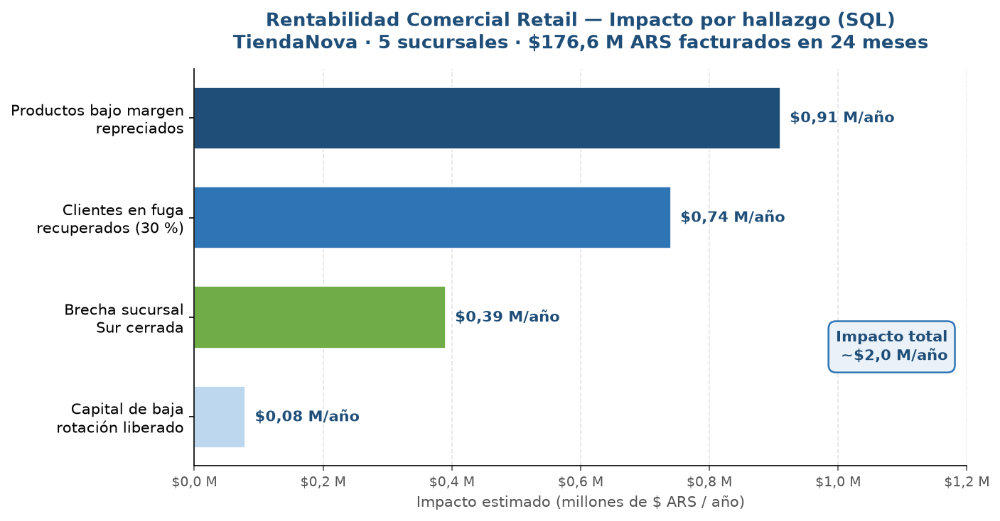

# 🗄️ Análisis de Rentabilidad Comercial — Retail Multi-sucursal

> **Herramienta:** SQL (SQLite)
> **Sector:** Comercial / Retail
> **Contexto:** Cadena minorista "TiendaNova" — 5 sucursales · 800 clientes · 37 productos · 15.700 ventas
> **Período:** Enero 2024 – Diciembre 2025

---

## 🎯 El problema

La cadena facturaba **$176,6 M** en 24 meses, pero la rentabilidad se gestionaba "a ojo".
Tres preguntas que valen plata no tenían respuesta:

- ¿Qué productos estamos vendiendo **a pérdida** sin saberlo?
- ¿Qué clientes **dejaron de comprar** y cuánto dinero se fue con ellos?
- ¿Por qué una sucursal **rinde menos** que el resto?

> *"Vendíamos mucho, pero al final del mes el margen no cerraba y no sabíamos por qué."*

El margen promedio era del **28,2 %** — sano en apariencia, pero escondía fugas que solo
aparecen cuando cruzás ventas, costos, descuentos, clientes y sucursales en un mismo modelo.

---

## 💡 La solución

Modelé los datos en un **esquema estrella** y escribí 5 consultas SQL que detectan
exactamente dónde se fuga el margen y el capital. Cada consulta responde una pregunta
de negocio y termina con un número accionable.

```
ventas (15.700 líneas)
│   fecha · cantidad · precio_unitario · descuento · costo_unitario · ingreso · margen
│
├── clientes   → segmento · ciudad · región · fecha_alta
├── productos  → categoría · costo_unitario · precio_lista
└── sucursales → nombre · ciudad · región
```

| # | Consulta | Pregunta que responde |
|---|---|---|
| 00 | [`00_perfilado.sql`](./queries/00_perfilado.sql) | ¿Con qué datos estoy trabajando? |
| 01 | [`01_margen_negativo.sql`](./queries/01_margen_negativo.sql) | ¿Qué productos se venden a pérdida? |
| 02 | [`02_baja_rotacion.sql`](./queries/02_baja_rotacion.sql) | ¿Qué productos inmovilizan capital? |
| 03 | [`03_fuga_clientes.sql`](./queries/03_fuga_clientes.sql) | ¿Cuántos clientes perdimos y cuánto valían? |
| 04 | [`04_brecha_sucursales.sql`](./queries/04_brecha_sucursales.sql) | ¿Qué sucursal rinde por debajo y cuánto cuesta? |

---

## 📊 Resultados

| Hallazgo | Antes | Después | Impacto anual |
|---|---|---|---|
| Productos bajo margen | No medido | 4 productos · $1,82 M acumulado | **$0,91 M/año** al repreciar |
| Clientes en fuga | Invisible | 156 clientes (21,7 % de la base) | **$0,74 M/año** al recuperarlos |
| Brecha de sucursal | Invisible | Sur: −16 % de ticket vs red | **$0,39 M/año** al cerrar la brecha |
| Capital inmovilizado | No medido | 5 productos · $79 k parados | Capital liberable |

### 💰 Impacto total estimado: **~$2,0 M/año** (≈ 8 % del margen anual)

Todo identificado sin invertir en marketing ni en nuevos clientes:
solo dejando de perder lo que ya se estaba perdiendo.

---

## 📈 Visualización



---

## 🔧 Técnicas utilizadas

- **Modelado estrella**: tabla de hechos `ventas` + 3 dimensiones (`clientes`, `productos`, `sucursales`).
- **CTEs encadenadas** (`WITH`) para legibilidad — un bloque por paso lógico.
- **JOINs** con `USING`, subconsultas correlacionadas y comparación contra línea base.
- **Métricas derivadas**: margen $, margen %, ticket promedio, tasa de rotación.
- **Validación cruzada**: consulta de perfilado (`00`) para controlar integridad antes de analizar.

---

## 📁 Archivos

| Archivo | Descripción |
|---|---|
| [`queries/`](./queries/) | 5 consultas SQL, una por pregunta de negocio |
| [`datos/generar_datos.py`](./datos/generar_datos.py) | Generador reproducible (semilla fija) |
| [`informe.md`](./informe.md) | Hallazgos completos con supuestos declarados |
| [`PASO_A_PASO.md`](./PASO_A_PASO.md) | Proceso de construcción fase a fase |

---

## ▶️ Cómo reproducirlo

```bash
cd proyectos/sql/rentabilidad-comercial-retail
python datos/generar_datos.py                              # genera retail.db
sqlite3 datos/retail.db ".read queries/01_margen_negativo.sql"
sqlite3 datos/retail.db ".read queries/03_fuga_clientes.sql"
```

---

## 🧠 Qué demuestra este proyecto

Que SQL no es solo una herramienta técnica — es una forma de hacer preguntas de negocio
y traducirlas en números accionables. Detecté **$2,0 M/año** de margen fugado sin incorporar
un solo cliente nuevo: solo mirando los datos con las preguntas correctas.
La misma lógica escala a millones de filas sin cambiar el modelo.

---

*Datos simulados con distribuciones realistas del sector retail · Portfolio de Datos y Analítica*
